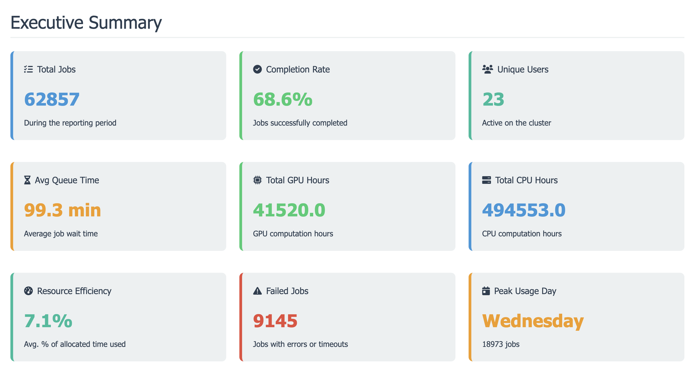
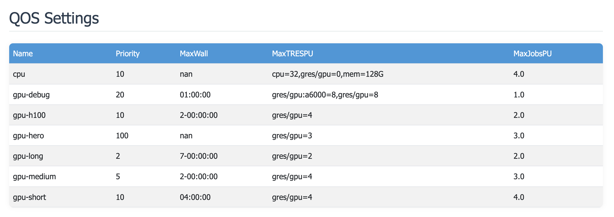
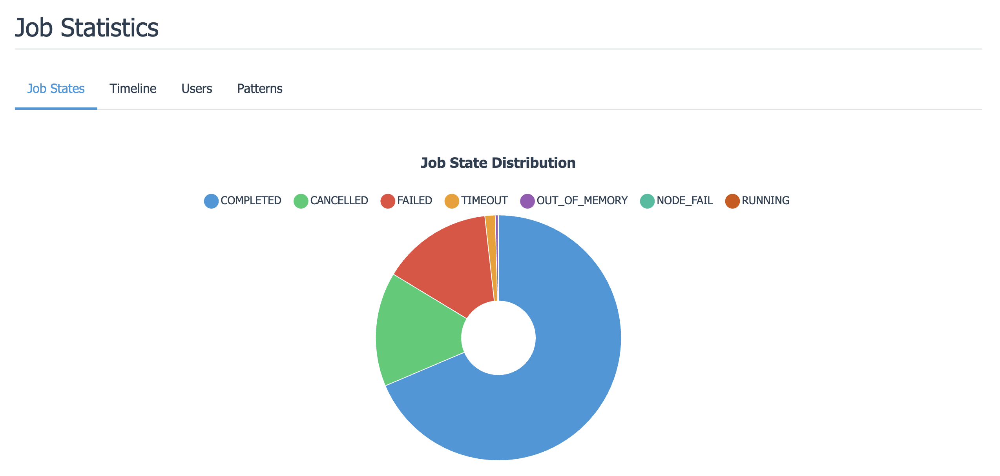
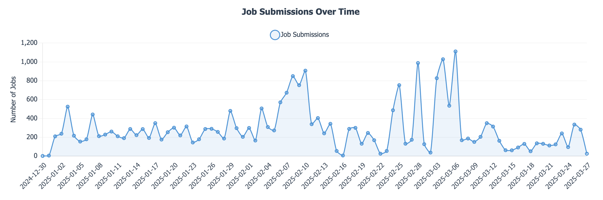
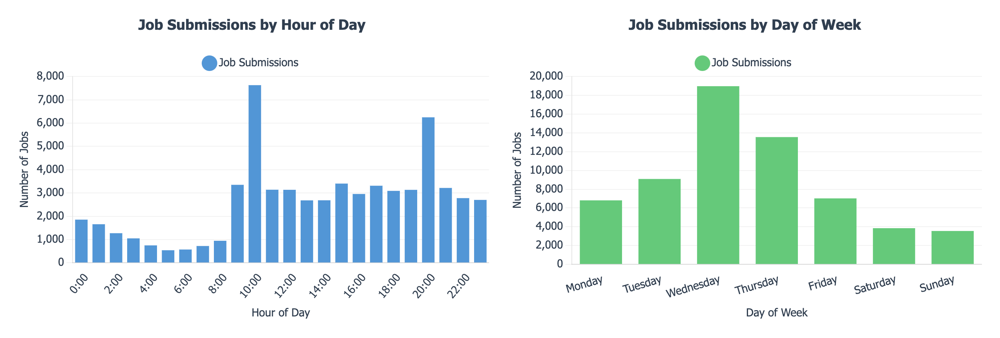
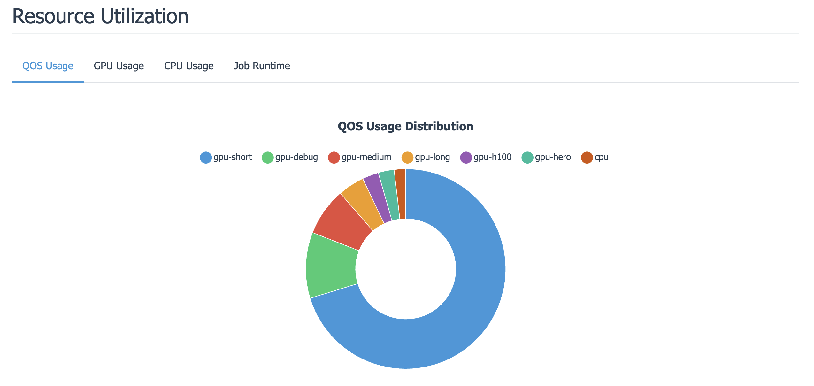
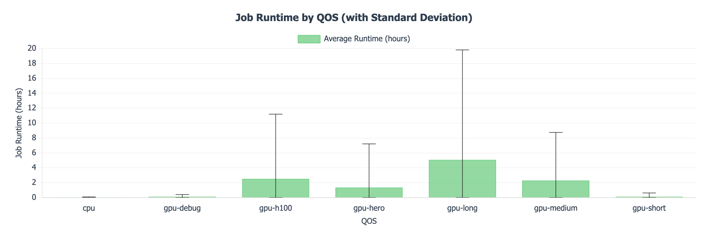
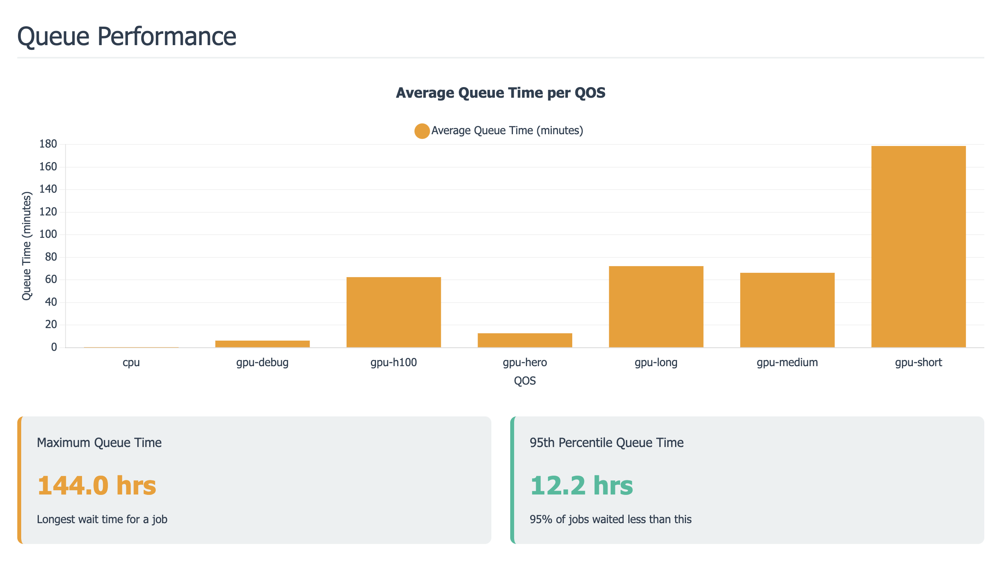
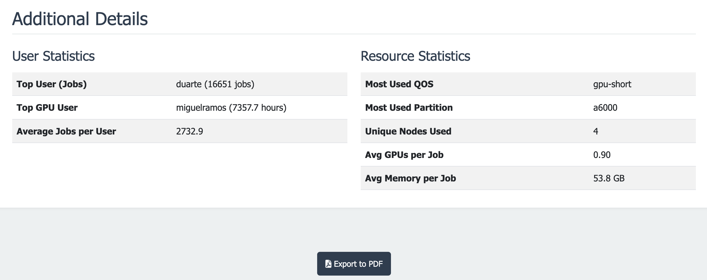

# ClusterScope: Slurm Analytics Report Generator

Unlock the Secrets of Your Cluster Usage! ✨

Below are some snapshots of our journey:

|  |  |  |
|---------------------------------------------------------|---------------------------------------------------------|---------------------------------------------------------|
|  |  |  |
|  |  |  |

## Features

- **Interactive Charts**: Visualizations powered by Chart.js with support for zooming and tooltips.
- **Detailed Metrics**: Displays job state distributions, submission timelines, user statistics, and resource usage.
- **Executive Summary**: Quick overview of key metrics such as total jobs, completion rate, unique users, queue times, and GPU/CPU hours.
- **QOS & User Information**: Lists QOS settings and user QOS assignments.
- **Customizable Date Ranges & Filtering**: Specify start/end dates, user, partition, or QOS values to exclude.
- **Export to PDF**: Easily export the report to PDF using your browser’s print dialog.

## Requirements

Ensure that the following commands are available and properly configured:
- `sacctmgr` (for retrieving QOS settings and user assignments)
- `sacct` (for job accounting data)


## Installation

1. **Clone the Repository**:

   ```bash
   git clone https://github.com/yourusername/ClusterScope.git
   cd ClusterScope
   ```

2. **Install Python Dependencies**:

   It is recommended to use a virtual environment:

   ```bash
   python3 -m venv venv
   source venv/bin/activate  # On Windows: venv\Scripts\activate
   pip install -r requirements.txt
   ```

## Usage

Run the script as **root** (or with appropriate permissions) to generate the HTML report. For example:

```bash
python3 slurm_report.py --start-date 2025-01-01
```

### Command-line Arguments

- `--start-date`: Start date in `YYYY-MM-DD` format (default: 30 days ago).
- `--end-date`: End date in `YYYY-MM-DD` format (default: today).
- `--user`: Filter the report by a specific user.
- `--partition`: Filter the report by a specific partition.
- `--output`: Name of the output HTML file (default: `slurm_report.html`).
- `--exclude-qos`: Comma-separated list of QOS values to exclude from the report.

## How It Works

1. **Fetching Data**:  
   The tool uses `sacctmgr` to obtain QOS settings and user assignments, and `sacct` to retrieve job accounting data based on the specified date range and filters.

2. **Data Processing & Analysis**:  
   Using Pandas, the script processes job data to calculate metrics such as queue time, runtime, and resource usage (CPU, Memory, GPUs).

3. **HTML Report Generation**:  
   A Jinja2 template converts the processed data into an interactive HTML report featuring charts (powered by Chart.js) and summary tables.

4. **PDF Export**:  
   The generated report can be easily exported as a PDF using your browser’s print dialog.

## Customization

Feel free to modify the Jinja2 HTML template within the script to adjust styles, colors, or layout to better fit your branding or reporting needs.

## License

See LICENSE.

## Contributing

Contributions are welcome! Please submit a pull request or open an issue for improvements or bug fixes.

